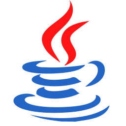
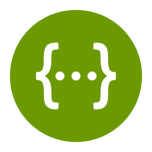

<p align="center">
  <a href="https://github.com/HuangZhongYao/boot-manage-ui">
    
  </a>
</p>
<p align="center">
  <a href="./LICENSE">
    
  </a>
  <a href="https://github.com/huangZhongYao/boot-manage" >
    
  </a>
  <a href="https://gitee.com/smog_huang/boot-manage" >
    
  </a>
</p>

# 🍊 Boot Admin 后端 🍊
Boot Admin 后端项目SpringBoot单体架构版

## 简介
Boot Admin 是一款极简风格的后台管理模板。  
前端使用 Vite + Vue3 + Naive UI + Pinia + Unocss + 无 Typescript降低门槛。

## 设计理念

## 技术栈
-  Java 17
-  SpringBoot 3.2.x
-  Mybatis-Plus
-  Sa-Token (相比SpringSecurity轻量、功能强大、API使用简单)
-  JWT
-  knife4j-ui + Swagger 3
-  Redis
-  MySQL 8

## 特性
- 😋 遵守Restful API风格 。
- 😀 使用当前最新技术 Java17 + SpringBoot 3.x 。 
- 😉 封装参数验证注解 ，基于`validation`封装常用非空、手机号、车牌号、邮箱、中文、非中文、IP、MAC... 常见类型数据参数验证, 减少90%校验参数代码。 源码中几乎很少看到判断参数的代码。
- 😄 统一返回值包装 ， 通过`ResponseBodyAdvice + 全局异常处理` 进行统一返回值包装处理。代码中再也无需手写 `R.ok(data) 和 R.error(msg,code)`等类似代码
- 🍗 封装通用DTO ， 对于基础字段无需重复定义只需继承 `BaseXXXDTO`。
- 🍔 封装对象转换工具 ， VO、DTO、Entity之间互相转换一行代码搞定，结合函数式接口还可以在转换时添加逻辑。
- ⏲  LocalDateTime ， 日期类型使用Java8 更安全的LocalDateTime， 配置jackson消息转换器解决Java8 LocalDateTime序列化时`'T'`。
- 💻 代码生成 ， 根据表一键生成前后端CRUD代码减少70%重复劳动专注业务逻辑。

## 安装

## 前端

Boot Admin 前端项目使用Vue3 + JavaScript 构建  
技术栈:
-  Vue 3
-  Pinia
-  Naive ui
-  Nginx
-  Unocss

源码
- 源码 GitHub: [boot-manage-ui | github](https://github.com/HuangZhongYao/boot-manage-ui)
- 源码 Gitee: [boot-manage-ui | gitee](https://gitee.com/smog_huang/boot-manage-ui)

## 文档

- 项目文档:

## 工程结构
```markdown
docs
  images                        项目描述用到静态资源目录
  boot_manage.sql               数据库初始化SQL文件
src
  main
    java 
      org.github.zuuuyao
        common                  公用类、工具类目录
          base                  实体、枚举、DTO、controller等基类文件目录
          constant              常量包
          exception             定义异常包
          function              自定义函数式接口包
          response              接口响应值对象包
            annotations         响应值包装处理注解包
          util                  工具类文件目录 
          validate              参数验证注解目录
        config                  配置类存方目录
          mybatis               mybatis配置相关
            handel              mybatis自动填充字段处理包
            extension           扩展mybatis包
          security              安全框架配置包
          swagger               swagger信息配置包
          web                   消息转换器、全局统一返回值包装、全局异常处理等web相关配置包
        entity                  实体类文件目录
        repository              仓储层文件目录
        service                 Service文件目录
        web                     Controller文件目录
        BootManageApplication   项目启动类入口文件 
    resources 
      mapper                    mybatis Mapper.xml文件目录
      markdown                  knife4j自定义swagger文档目录
      templates                 代码生成模板文件目录
    logback-spring.xml          日志框架配置文件
  test                          单元测试包
LICENSE                         开源许可协议文件
README.md                       项目描述文件
pom.xml                         maven配置文件

```
- docs
  - images `项目描述用到静态资源目录`
  - boot_manage.sql `数据库初始化SQL文件`
- src
  - main
    - java 
      - org.github.zuuuyao
        - common `公用类、工具类目录`
          - base `实体、枚举、DTO、controller等基类文件目录`
          - util `工具类文件目录` 
          - validate `参数验证注解目录`
        - config `配置类存方目录`
          - mybatis `mybatis配置相关`
            - handel `mybatis自动填充字段处理包`
            - extension `扩展mybatis包`
          - security `安全框架配置包`
          - swagger `swagger信息配置包`
          - web `消息转换器、全局统一返回值包装、全局异常处理等web相关配置包`
        - entity `实体类文件目录`
        - repository `仓储层文件目录`
        - service `Service文件目录`
        - web  `Controller文件目录`
        - BootManageApplication `项目启动类入口文件` 
    - resources 
      - mapper `mybatis Mapper.xml文件目录`
      - markdown `knife4j自定义swagger文档目录`
      - templates `代码生成模板文件目录`
    - logback-spring.xml `日志框架配置文件`
  - test `单元测试包`
- LICENSE `开源许可协议文件`
- README.md `项目描述文件`
- pom.xml `maven配置文件`

## 代码预览
- Controller层  
  Controller层结构清晰不做任何业务逻辑。因为做了统一响应值包装也无需返回手动返回 `R.ok(data)`
```java
    @Operation(summary = "分页查询", description = "分页查询角色接口")
    @GetMapping(value = "/pageQueryList", produces = MediaType.APPLICATION_JSON_VALUE)
    @ApiOperationSupport(authors = "zuuuYao")
    public Page<RolePageQueryListItemVo> pageQueryList(RolePageQueryInputDTO inputDTO) {
        return roleService.pageQueryList(inputDTO);
    }

    @Operation(summary = "根据状态查询角色", description = "根据角色启用状态查询")
    @GetMapping(value = "/queryList", produces = MediaType.APPLICATION_JSON_VALUE)
    @Parameters({
        @Parameter(name = "enable", description = "true|false|不传递,true查询启用,false=查询禁用,不传入=查询全部"),
    })
    @ApiOperationSupport(authors = "zuuuYao")
    public List<RoleVo> queryList(Boolean enable) {
        return roleService.queryList(enable);
    }

    @Operation(summary = "查询角色下的用户", description = "查询指定角色下有哪些用户")
    @GetMapping(value = "/queryRoleUserList", produces = MediaType.APPLICATION_JSON_VALUE)
    @Parameters({
        @Parameter(name = "id", description = "角色id"),
    })
    @ApiOperationSupport(authors = "zuuuYao")
    public List<RoleUserModel> queryRoleUserList(@RequestParam(name = "id") Long id) {
        return roleService.queryRoleUserList(id);
    }

    @Operation(summary = "角色设置用户", description = "批量给角色设置用户")
    @ApiResponse(responseCode = "200", description = "ok")
    @PostMapping(value = "/setRoleUser", produces = MediaType.APPLICATION_JSON_VALUE)
    public Boolean setRoleUser(@RequestBody @Validated SetRoleUserInputDTO inputDTO) {
        return roleService.setRoleUser(inputDTO);
    }
```
- Service 层  
  所有的业务逻辑放到Service,不要controller在写service也在写
```java
    @Transactional(rollbackFor = Exception.class)
    @Override
    public Boolean delRole(BaseManyLongIdInputDTO inputDTO) {

        // 清除角色与权限中间表数据
        roleResourcesRepository.delete(Wrappers
                .<RoleResourcesEntity>lambdaQuery()
                .in(RoleResourcesEntity::getRoleId, inputDTO.getIds()));
        // 清除角色与用户中间表数据
        userRoleRepository.delete(Wrappers
                .<UserRoleEntity>lambdaQuery()
                .in(UserRoleEntity::getRoleId, inputDTO.getIds()));
        // 删除角色
        roleRepository.deleteByIds(inputDTO.getIds());

        return true;
    }

    @Override
    public Page<RolePageQueryListItemVo> pageQueryList(RolePageQueryInputDTO inputDTO) {

        // 执行查询
        Page<RolePageQueryListItemVo> result =
                this.roleRepository.pageQueryList(inputDTO.toMybatisPageObject(), inputDTO);

        // 设置权限id集合
        result.getRecords().forEach(record -> {
            // 权限id字符串用逗号拼接的
            String resourcesIds = record.getResourcesIds();
            if (StrUtil.isNotBlank(resourcesIds)) {
                // 将字符串ids转为long集合
                List<Long> permissionIds =
                        Stream.of(resourcesIds.split(",")).map(Long::valueOf).toList();
                // 赋值
                record.getPermissionIds().addAll(permissionIds);
            }
        });

        return result;
    }

    @Override
    public List<RoleVo> queryList(Boolean enable) {
        return roleRepository.selectList(
                Wrappers.<RoleEntity>lambdaQuery().eq(null != enable, RoleEntity::getEnable, enable),
                RoleVo.class);
    }

    @Transactional(rollbackFor = Exception.class)
    @Override
    public Boolean editRole(EditRoleInputDTO inputDTO) {
        // 判断该角色id是否有效
        if (!roleRepository.exists(
                Wrappers.<RoleEntity>lambdaQuery().eq(RoleEntity::getId, inputDTO.getId()))) {
            throw new UserFriendlyException("该角色不存在");
        }

        // 更新权限
        if (inputDTO.getPermissionIds() != null) {

            // 先清空角色权限
            roleResourcesRepository.delete(Wrappers
                    .<RoleResourcesEntity>lambdaQuery()
                    .eq(RoleResourcesEntity::getRoleId, inputDTO.getId()));

            // 使用流创建UserRoleEntity对象
            List<RoleResourcesEntity> roleResourcesEntities = inputDTO.getPermissionIds()
                    .stream()
                    .map(permissionId -> RoleResourcesEntity.builder()
                            .roleId(inputDTO.getId())
                            .resourcesId(permissionId)
                            .build())
                    .toList();

            // 批量插入角色权限数据
            roleResourcesRepository.insert(roleResourcesEntities, roleResourcesEntities.size());
        }

        // 更新角色的数据
        RoleEntity updateEntity = ModelMapperUtil.map(inputDTO, RoleEntity.class);

        // 执行更新
        roleRepository.updateById(updateEntity);

        return true;
    }


    @Override
    @Transactional(rollbackFor = Exception.class)
    public Boolean setRoleUser(SetRoleUserInputDTO inputDTO) {
        RoleEntity roleEntity = this.roleRepository.selectById(inputDTO.getRoleId());

        if (null == roleEntity) {
            throw new UserFriendlyException("该角色不存在");
        }

        if (CollectionUtil.isEmpty(inputDTO.getUserIds())) {
            return true;
        }

        // 已经存在用户
        List<Long> alreadyExists =
                userRoleRepository.selectList(Wrappers.<UserRoleEntity>lambdaQuery()
                                .eq(UserRoleEntity::getRoleId, inputDTO.getRoleId()))
                        .stream()
                        .map(UserRoleEntity::getUserId)
                        .toList();

        // 新增用户id
        Collection<Long> addUser = CollectionUtil.subtract(inputDTO.getUserIds(), alreadyExists);
        // 新增用户id集合转换为UserRoleEntity集合
        List<UserRoleEntity> addUserRoleEntityList = addUser.stream()
                .map(userId ->
                        UserRoleEntity
                                .builder()
                                .roleId(inputDTO.getRoleId())
                                .userId(userId)
                                .build())
                .toList();
        // 执行新增
        userRoleRepository.insert(addUserRoleEntityList, addUserRoleEntityList.size());

        // 移除用户id
        Collection<Long> removeUser = CollectionUtil.subtract(alreadyExists, inputDTO.getUserIds());
        // 执行移除
        if (!removeUser.isEmpty()) {
            userRoleRepository.delete(Wrappers.<UserRoleEntity>lambdaQuery()
                    .eq(UserRoleEntity::getRoleId, inputDTO.getRoleId())
                    .in(UserRoleEntity::getUserId, removeUser));
        }

        return true;
    }

    @Override
    public Boolean setState(SetRoleStateInputDTO inputDTO) {

        // 判断该角色id是否有效
        if (!roleRepository.exists(
            Wrappers.<RoleEntity>lambdaQuery().eq(RoleEntity::getId, inputDTO.getId()))) {
            throw new UserFriendlyException("该角色不存在");
        }

        RoleEntity updateEntity = RoleEntity.builder().enable(inputDTO.getState()).build();
        updateEntity.setId(inputDTO.getId());

        roleRepository.updateById(updateEntity);

        return true;
    }

    @Transactional(rollbackFor = Exception.class)
    @Override
    public Boolean addRole(AddRoleInputDTO inputDTO) {
        // 判断角色名是否重复
        if (roleRepository.exists(
                Wrappers.<RoleEntity>lambdaQuery().eq(RoleEntity::getName, inputDTO.getName()))) {
            throw new UserFriendlyException("该角色已存在");
        }

        // 判断角色编码是否重复
        if (roleRepository.exists(
                Wrappers.<RoleEntity>lambdaQuery().eq(RoleEntity::getCode, inputDTO.getCode()))) {
            throw new UserFriendlyException("该角色编码已存在");
        }

        // 将DTO转换为实体对象
        RoleEntity roleEntity = ModelMapperUtil.map(inputDTO, RoleEntity.class);
        // 插入数据库
        roleRepository.insert(roleEntity);

        // 如果勾选了权限就插入权限数据
        if (inputDTO.getPermissionIds() != null) {

            // 使用流创建UserRoleEntity对象
            List<RoleResourcesEntity> roleResourcesEntities = inputDTO.getPermissionIds()
                    .stream()
                    .map(permissionId -> RoleResourcesEntity.builder()
                            .roleId(roleEntity.getId())
                            .resourcesId(permissionId)
                            .build())
                    .toList();

            // 批量插入角色权限数据
            roleResourcesRepository.insert(roleResourcesEntities, roleResourcesEntities.size());
        }
        return true;
    }
```
- Repository层    
DAO层或Mapper层 , 继承 `BaseMapperExtension` 扩展mybatis查询结构转换更方便提高效率。
```java
package org.github.zuuuyao.repository;

import com.baomidou.mybatisplus.extension.plugins.pagination.Page;
import java.util.List;
import org.apache.ibatis.annotations.Param;
import org.github.zuuuyao.config.mybatis.extension.BaseMapperExtension;
import org.github.zuuuyao.entity.system.RoleEntity;
import org.github.zuuuyao.service.role.dto.input.RolePageQueryInputDTO;
import org.github.zuuuyao.service.role.dto.output.RolePageQueryListItemVo;
import org.github.zuuuyao.service.role.dto.output.RoleVo;
import org.github.zuuuyao.service.user.model.UserRoleModel;
import org.springframework.stereotype.Repository;

/**
 * @Desc: Created by IntelliJ IDEA.
 * @Author: ZhongYao.Huang
 * @Copyright: ZuuuuYao By Github
 * @Time: 2024-07-13 18:39
 */
@Repository
public interface RoleRepository extends BaseMapperExtension<RoleEntity> {

    /**
     * 分页查询
     *
     * @param page     分页插件参数
     * @param inputDTO 查询参数
     * @return 分页结果
     */
    Page<RolePageQueryListItemVo> pageQueryList(@Param("page") Page page,
                                                @Param("param") RolePageQueryInputDTO inputDTO);

    /**
     * 查询用户角色根据用户id
     *
     * @param userId 用户id
     * @return 角色列表
     */
    List<RoleVo> queryUserRolesByUserId(@Param("userId") Long userId);

    /**
     * 批量查询用户角色根据用户id
     *
     * @param userIds 用户id集合
     * @return 角色列表
     */
    List<UserRoleModel> queryUserRolesByUserIds(@Param("userIds") List<Long> userIds);
}

```

## 版权说明

本项目使用 `MIT协议`，默认授权给任何人，被授权人可免费地无限制的使用、复制、修改、合并、发布、发行、再许可、售卖本软件拷贝、并有权向被供应人授予同等的权利，但必须满足以下条件:

- 复制、修改和发行本项目代码需包含原作者的版权及许可信息，包括但不限于文件头注释、协议等

简单说作者只想保留源码中注释版权，没有任何其他限制。
